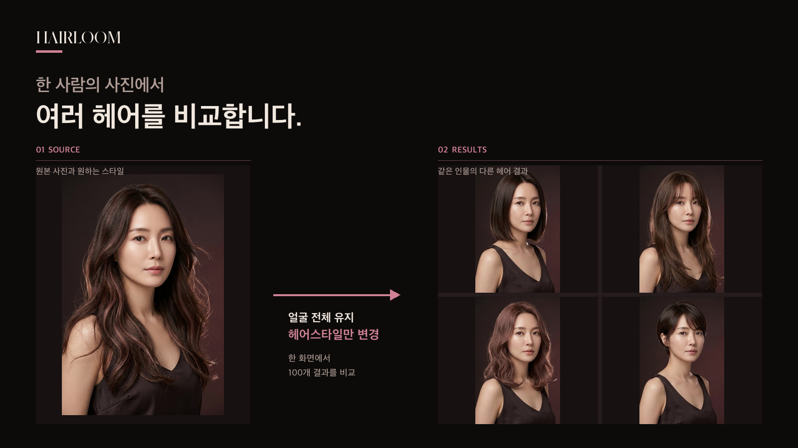

# Hairloom 1.0.0

[한국어 README](README.md)

[](https://github.com/Marker-Inc-Korea/HairLoom/actions/workflows/mobile-ios-build.yml)
[](https://github.com/Marker-Inc-Korea/HairLoom/actions/workflows/mobile-android-preview.yml)


<p align="center">
  
</p>

<p align="center"><sub>Feature illustration using the same AI-generated virtual person. This is not a customer photo or an image produced by a live Hairloom generation run.</sub></p>

Hairloom is a **noncommercial source-available application** for quickly comparing hairstyle results based on your photos and request.

Start with one front photo and optionally add side, back, or other angles.

## Features

- Capture a photo or choose one from the gallery
- One required front image with optional additional angles
- Describe the desired style, color, and known treatment history
- Generate and compare 100 hairstyle results in one batch
- Open results uncropped at their original aspect ratio
- Manage API connection status and customer data inside the app

## Ways to use Hairloom

| Environment | Available scope |
| --- | --- |
| Computer | Preview the product UI and hairstyle catalog locally |
| Android | Camera/gallery, analysis, and hairstyle generation |
| iOS source build | Run through Xcode Simulator or a development device |

Real analysis and image generation run only in the Android/iOS app and require a **separately billed OpenAI API key**. ChatGPT Plus/Pro subscriptions and OpenAI API billing are separate.

### Android APK

1. Download these files from the [Hairloom 1.0.0 Release](https://github.com/Marker-Inc-Korea/HairLoom/releases/tag/v1.0.0):

```text
Hairloom-1.0.0-android.apk
Hairloom-1.0.0-android.apk.sha256
```

2. Verify the checksum.

```bash
shasum -a 256 Hairloom-1.0.0-android.apk
cat Hairloom-1.0.0-android.apk.sha256
```

3. Open the APK on Android and allow **Install unknown apps** when prompted.

> The GitHub APK is a debug-signed sideload build. If a newer build uses a different certificate, uninstall the previous app before installing it. This can reset app-private photos, results, and settings.

### Connect an API key in the app

1. Configure an API project, billing, and usage limits at [OpenAI Platform](https://platform.openai.com/).
2. Open `설정` (Settings) or `API 설정하기` (API settings) in Hairloom.
3. Save the API key through the native secure dialog.
4. Add photos and a style request, then start generation.

The key stays only in Android Keystore or iOS Keychain. It never enters a browser input, WebView storage, logs, or repository files.

## Run on a computer

Requirements: Node.js 20 or newer and Git.

```bash
git clone https://github.com/Marker-Inc-Korea/HairLoom.git
cd HairLoom
npm ci
npm run verify
npm run start
```

Open `http://127.0.0.1:4180/`.

The computer web shell is for UI and catalog preview. It does not accept an API key or run real image generation.

## Documentation

- [1.0.0 release notes](docs/releases/v1.0.0.md)
- [AI and native technical changes](docs/releases/v1.0.0-technical.md)
- [Launch announcement and reusable copy](docs/releases/v1.0.0-launch.md)
- [Private security reporting](SECURITY.md)
- [Commercial-use guidance](COMMERCIAL-LICENSE.md)

## Bugs and contributions

Report ordinary bugs through [GitHub Issues](https://github.com/Marker-Inc-Korea/HairLoom/issues). Include the Hairloom version and environment, reproduction steps, and expected versus actual behavior.

Never post API keys, customer photos, generated results, authentication files, or local paths in an issue. Use the private process in [SECURITY.md](SECURITY.md) for security or privacy problems.

Run the following before and after a code change:

```bash
npm ci
npm run verify
```

## License

Hairloom is **noncommercial source-available software** under the [PolyForm Noncommercial License 1.0.0](LICENSE).

Personal study, research, experimentation, and noncommercial projects are permitted. Commercial operation, paid services, deployment by for-profit organizations, or inclusion in commercial products requires a separate written license from NomaDamas.

PolyForm Noncommercial is not an OSI-approved open-source license.
