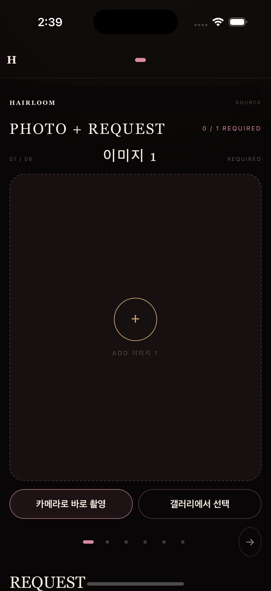

# Hairloom 1.0.0

[한국어 README](README.md)

[](https://github.com/Marker-Inc-Korea/HairLoom/actions/workflows/mobile-ios-build.yml)
[](https://github.com/Marker-Inc-Korea/HairLoom/actions/workflows/mobile-android-preview.yml)


Hairloom is a source-available hairstyle consultation application that creates design results from customer-supplied originals and requests.

```text
SOURCE → RESULTS → LOCK
```

Version 1.0.0 prioritizes two distribution methods:

- **Computer:** clone the repository and run the local web shell.
- **Android:** download and sideload the APK from GitHub Releases.

Play Store and App Store distribution is deferred.

<p align="center">
  
</p>

## Quick start

| Environment | Available scope | Real image generation |
| --- | --- | --- |
| Computer web shell | SOURCE, catalog, and consultation UI preview | Not supported |
| Android APK | Camera/gallery, analysis, 100 results, and LOCK | Requires a separately billed OpenAI API key |
| iOS source build | Xcode Simulator and development devices | Requires a separately billed OpenAI API key |

The browser has no API-key input or Provider request path. Real analysis and image generation run only in the native Android/iOS app.

## Install and run on a computer

### Requirements

- Node.js 20 or newer
- Git
- Windows, macOS, or Linux

### Installation

```bash
git clone https://github.com/Marker-Inc-Korea/HairLoom.git
cd HairLoom
npm ci
npm run verify
npm run start
```

Open:

```text
http://127.0.0.1:4180/
```

Health check:

```text
http://127.0.0.1:4180/healthz
```

The server binds only to `127.0.0.1`. The computer web shell previews the product UI and catalog locally; it never accepts an OpenAI API key or runs image generation.

## Install the Android APK

Open the latest `Hairloom Android Preview` under [GitHub Releases](https://github.com/Marker-Inc-Korea/HairLoom/releases).

Download:

```text
Hairloom-android-preview.apk
Hairloom-android-preview.apk.sha256
```

### Verify the checksum

macOS or Linux:

```bash
shasum -a 256 Hairloom-android-preview.apk
cat Hairloom-android-preview.apk.sha256
```

Windows PowerShell:

```powershell
(Get-FileHash .\Hairloom-android-preview.apk -Algorithm SHA256).Hash.ToLower()
Get-Content .\Hairloom-android-preview.apk.sha256
```

Confirm that the values match, then open the APK on Android. When prompted, allow **Install unknown apps** for the browser or file manager used to open it.

With ADB:

```bash
adb install Hairloom-android-preview.apk
```

The APK supports Android 6.0/API 23 or newer and targets SDK 35.

> GitHub APKs are debug-signed sideload builds. If a new build uses a different signing certificate, Android may report `INSTALL_FAILED_UPDATE_INCOMPATIBLE`. Uninstalling the previous Hairloom Preview allows installation but also resets app-private photos, outputs, and settings.

## OpenAI API setup and use

Real Hairloom analysis and image generation require a user-owned **separately billed OpenAI API key**. ChatGPT Plus/Pro subscriptions and OpenAI API billing are separate.

1. Configure an API project and billing at [OpenAI Platform](https://platform.openai.com/).
2. Create a personal API key.
3. On the Hairloom Android SOURCE screen, select `이미지 생성 연결`.
4. Enter the key through the native secure dialog.
5. Add `Image 1`, enter a REQUEST, and start result generation.

Fixed Provider configuration:

| Purpose | Endpoint | Model |
| --- | --- | --- |
| Hair analysis | `https://api.openai.com/v1/responses` | `gpt-4.1-mini` |
| Image edit | `https://api.openai.com/v1/images/edits` | `gpt-image-2` |

The API key stays only in Android Keystore or iOS Keychain. It never enters WebView JavaScript, `localStorage`, `sessionStorage`, service workers, logs, exports, or repository files.

One generation batch owns 100 fixed result slots, and retries can create additional billable requests. Check the API project's billing state, usage limits, and budget before use.

Unsupported authentication methods:

```text
ChatGPT passwords, cookies, or browser tokens
Codex auth files (~/.codex/auth.json)
Private God Tibo authentication
Browser Bearer requests or imagen.web.js
```

## Product flow

1. Capture an original with the camera or select one from the gallery.
2. Enter the requested style, color, and known treatment history in `REQUEST`.
3. Native analysis starts the fixed 100-slot batch.
4. Open completed results uncropped at their original aspect ratio.
5. Select 1–6 and pass them to LOCK.

`Image 1` is required; `Images 2–6` are optional. Camera and gallery inputs use the same prepared-original pipeline.

## Product and privacy guarantees

- Only user-prepared originals may enter Provider requests.
- Generated images and catalog images are never reused for later analysis or generation.
- Every slot retains its index, design ID, original hash, and retry ownership regardless of completion order.
- Completed outputs survive restart; interrupted work returns to `retryable` under the same slot.
- Hair analysis never infers identity, age, ethnicity, face shape, body, health, or gender identity.
- Unobservable bleach, perm, and extension history remains unknown unless supplied by the user.
- `모든 고객 데이터 삭제` deletes originals, outputs, job files, and batch journals.
- The Provider key is deleted separately through `연결 삭제`.
- Completed and cancelled customer data is cleaned after seven days at app startup.

## Version 1.0.0

Hairloom uses Semantic Versioning: `MAJOR.MINOR.PATCH`.

```text
Current version: 1.0.0
Android: versionName 1.0.0 / versionCode 1
iOS: MARKETING_VERSION 1.0.0 / build 1
```

See the [1.0.0 release notes](docs/releases/v1.0.0.md).

## Bugs and contributions

Report ordinary bugs through GitHub Issues.

A useful bug report includes:

- Hairloom version and environment;
- reproduction steps;
- expected and actual behavior; and
- error messages or screenshots with sensitive information removed.

Never post API keys, customer photos, generated outputs, authentication files, or local paths in an issue. Use the private process in [SECURITY.md](SECURITY.md) for security or privacy problems.

Code contributions:

1. Confirm the problem and scope in an issue.
2. Make a small, focused change on a separate branch.
3. Run `npm run verify`.
4. Open a pull request with rationale, verification results, and user impact.

Changes that weaken original-source lineage, native credential storage, fixed 100-slot ownership, or privacy boundaries will not be accepted.

## Development and verification

```bash
npm ci
npm run verify
npm run mobile:prepare
npm run mobile:test
npm run mobile:doctor
```

Current baseline:

```text
106 tests passing
1,080-design taxonomy check passing
6,500-design master catalog check passing
500 structure groups
12 finish records per structure
288 deterministic variations per structure
catalogVersion: HLM-MASTER-2026-07-EXPLORE-2
promptVersion: HLM-EXPLORE-PROMPT-2026-07-4
trendRegistryVersion: HLM-TRENDS-2026-07-1
```

Primary CI workflows:

- [`Mobile Android Preview`](.github/workflows/mobile-android-preview.yml): Android APK and SHA-256 artifact/prerelease
- [`Mobile iOS Build`](.github/workflows/mobile-ios-build.yml): iOS Simulator build, install, and launch
- [`Hair Trend Refresh`](.github/workflows/hair-trend-refresh.yml): metadata-only biweekly pull requests

## License

Hairloom is **noncommercial source-available software** under the [PolyForm Noncommercial License 1.0.0](LICENSE).

- Personal study, research, experimentation, and noncommercial projects are permitted.
- Commercial operation, paid services, deployment by for-profit organizations, and embedding in commercial products are not permitted by the default license.
- Commercial use requires a separate written license from NomaDamas. See [COMMERCIAL-LICENSE.md](COMMERCIAL-LICENSE.md).

PolyForm Noncommercial is not an OSI-approved open-source license. Hairloom is described as `source-available`, `public source`, or `noncommercial source license`, not as OSI open source.

## Never commit

```text
.env
imagen.web.js
API keys
customer photos
generated customer images
native signing material
local SDK paths
crash artifacts
.gjc/
mobile-dist/
```

Hairloom and BeautyTape are separate repositories. Hairloom changes belong only in `Marker-Inc-Korea/HairLoom`.
